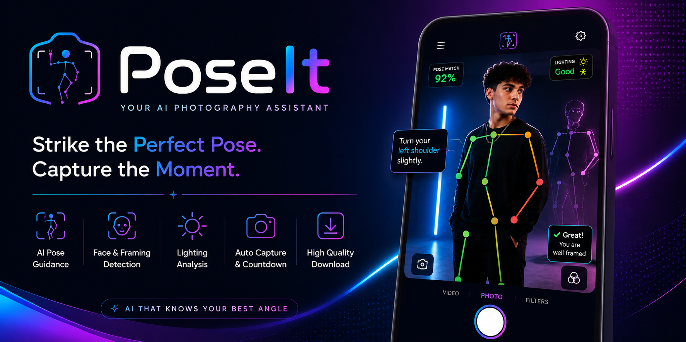

<p align="center">
  
</p>

<h1 align="center">📸 PoseIt</h1>

<p align="center">
  <strong>Your AI Photography Assistant</strong>
</p>

<p align="center">
  Guide your pose • Capture perfect portraits • Download instantly
</p>

<p align="center">
  
  
  
  
  
  
</p>

---

# ✨ Overview

**PoseIt** is an AI-powered photography assistant that runs entirely in your browser.

Using **MediaPipe Pose** and **Face Detection**, PoseIt analyzes your body posture in real time, compares it with professional poses, provides intelligent guidance, and automatically captures your photo when everything is perfectly aligned.

No backend.
No uploads.
No cloud processing.

Everything happens locally on your device.

---

# 🚀 Features

## 📷 Smart Camera

- Live webcam preview
- Front & rear camera support (mobile)
- Mirror preview for selfie mode
- High-quality image capture
- Manual shutter
- Automatic shutter

---

## 🤖 AI Pose Detection

- Real-time MediaPipe Pose tracking
- 33 body landmarks
- Live skeleton rendering
- Ghost pose overlay
- Pose similarity scoring (0–100%)
- Joint angle comparison
- Real-time pose correction

---

## 🎯 Intelligent Guidance

Receive live feedback such as:

- Raise your left arm
- Lower your right shoulder
- Straighten your back
- Tilt your head
- Move left/right
- Move closer to the camera
- Step back slightly
- Hold still
- Perfect pose detected

---

## 😊 Face & Framing Analysis

- Face detection
- Face centering
- Framing assistance
- Distance estimation
- Body visibility checks
- Head orientation guidance

---

## 💡 Lighting Analysis

Detects poor lighting and provides suggestions such as:

- Too dark
- Move toward the light
- Lighting looks great

---

## 📸 Smart Capture

Automatically captures the photo when:

- Pose similarity ≥ 95%
- Face detected
- Subject centered
- Lighting acceptable

Includes:

- Animated countdown
- Manual capture
- Retake
- Preview screen

---

## 🎨 Photo Filters

- Original
- Warm
- Cool
- Portrait
- Black & White
- Vintage

---

## 💾 Export

- High-resolution image capture
- Download as PNG
- No server required
- Instant download

---

## ⚙️ Settings

- Skeleton overlay
- Ghost pose
- Auto capture
- Countdown
- Mirror preview
- Overlay in exported photo
- Filters
- Dark mode

---

# 🛠 Tech Stack

| Category | Technology |
|----------|------------|
| Frontend | HTML5 |
| Styling | CSS3 |
| Language | JavaScript (ES6 Modules) |
| Pose Detection | MediaPipe Pose |
| Face Detection | MediaPipe Face Detection |
| Graphics | HTML5 Canvas |
| Camera | Browser Camera API |
| Image Processing | OpenCV.js (Optional) |

---

# 📂 Project Structure

poseit/
├── index.html
├── css/
│   ├── styles.css
│   ├── camera.css
│   ├── ui.css
│   └── responsive.css
├── js/
│   ├── app.js
│   ├── camera.js
│   ├── pose.js
│   ├── guidance.js
│   ├── capture.js
│   ├── download.js
│   ├── poseLibrary.js
│   ├── ui.js
│   └── utils.js
├── assets/
│   ├── icons/
│   ├── logo/
│   ├── poses/
│   └── banner.png
└── README.md

---

# ⚡ Getting Started

## Clone the repository

```bash
git clone https://github.com/yourusername/poseit.git
```

```bash
cd poseit
```

---

## Run Locally

### VS Code

1. Install **Live Server**
2. Open the project
3. Right-click `index.html`
4. Select **Open with Live Server**
5. Allow camera permission

### Python

```bash
python -m http.server 5500
```

Open:

```
http://localhost:5500
```

---

# 📱 Browser Support

* ✅ Google Chrome
* ✅ Microsoft Edge
* ✅ Mozilla Firefox
* ✅ Safari
* ✅ Android Chrome
* ✅ iOS Safari

> Camera access requires **HTTPS** or **localhost**.

---

# 📸 Screenshots

Replace these placeholders after completing the project.

| Home           | Pose Guidance  |
| -------------- | -------------- |
| *(Screenshot)* | *(Screenshot)* |

| Ghost Pose     | Preview        |
| -------------- | -------------- |
| *(Screenshot)* | *(Screenshot)* |

---

# 🗺 Roadmap

* Face Mesh integration
* Smile detection
* Eye-open detection
* AI pose recommendations
* Custom pose library
* Group pose guidance
* Offline PWA support
* AI composition suggestions
* Background quality analysis
* Cloud photo gallery
* Camera exposure analysis

---

# 🤝 Contributing

Contributions, feature requests, and suggestions are welcome.

Feel free to fork the project and submit a pull request.

---

# 📄 License

This project is licensed under the **MIT License**.

---

